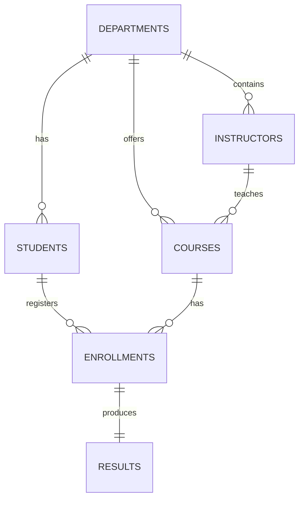

# DBMS Results

This document presents final results for the Student Information Management System using ER modeling, relational schema design, SQL querying, and normalization.

## 1. Result from ER Modeling
- Identified core entities: Student, Department, Instructor, Course, Enrollment, Result.
- Identified relationships:
  - Department -> Students (1:N)
  - Department -> Courses (1:N)
  - Department -> Instructors (1:N)
  - Student -> Course (M:N) resolved through Enrollment
  - Enrollment -> Result (1:1)

ER model diagram:

- Outcome: A complete conceptual model that avoids ambiguity and supports scalable academic record management.

Reference: [er-diagram.md](er-diagram.md)

## 2. Result from Relational Schema Design
- ER model converted to normalized tables with keys and constraints.
- Primary keys, foreign keys, unique constraints, and indexes are defined.
- Tables implemented:
  - departments
  - students
  - instructors
  - courses
  - enrollments
  - results
- Outcome: A relational schema that enforces integrity and supports efficient joins and reporting.

Reference: [schema.sql](schema.sql)

## 3. Result from SQL Queries
Query execution supports required DBMS operations:
- Data insertion for all major entities
- Multi-table joins for student-course-result reports
- Aggregation and grouping for department-wise analytics
- Subquery for above-average marks analysis
- View-based retrieval through `v_student_course_result`
- Transaction block (START TRANSACTION / COMMIT / ROLLBACK)

Sample result highlights (from provided sample data):
- Department-wise student count returns one record each for Computer Science, Information Technology, and Electronics.
- Above-average marks query returns students with marks greater than class average.
- Average grade-point query ranks students by academic performance.

Reference: [queries.sql](queries.sql)

## 4. Result from Normalization
Normalization checks completed:
- 1NF: Atomic attributes, no repeating groups.
- 2NF: Composite-key dependencies handled in associative table (enrollments).
- 3NF: Transitive dependencies removed into separate master tables.
- BCNF-aligned structure for major functional dependencies.

Outcome:
- Reduced redundancy
- Better consistency on updates/deletes
- Improved data integrity for long-term usage

Reference: [dbms-notes.md](dbms-notes.md)

## 5. Final Outcome
The project now demonstrates complete Unit I-IV DBMS coverage with practical implementation:
- Conceptual model (ER)
- Logical model (relational schema)
- Physical/query layer (SQL + indexes + transactions)
- Quality model (normalization)

This makes the project suitable for DBMS coursework, viva, and mini-project submission.
